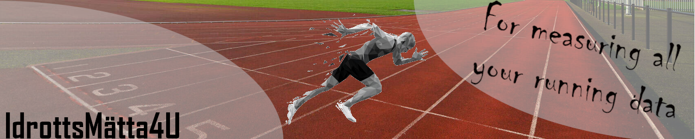

> IdrottsMätta4U is a system developped by KTH master students that provides data for elite sprinters using IMU sensors. The data that we can measure are: 
* Ground contact times
* Foot placement
* Step length
* Step frequency

# Table of Contents
* [Team Members](#team-members)
* [Project Demo](#project-demo)

# Team Members
* "A. Elsaid" <dummymail@kth.se>
* "J.J. van Esch" <jjve@kth.se>
* "M. Geisler" <mgeisler@kth.se>
* "L. Minet" <lminet@kth.se>
* "E. Perini" <eperini@kth.se>

# Project Demo
In this section we will display the data that our system provides
